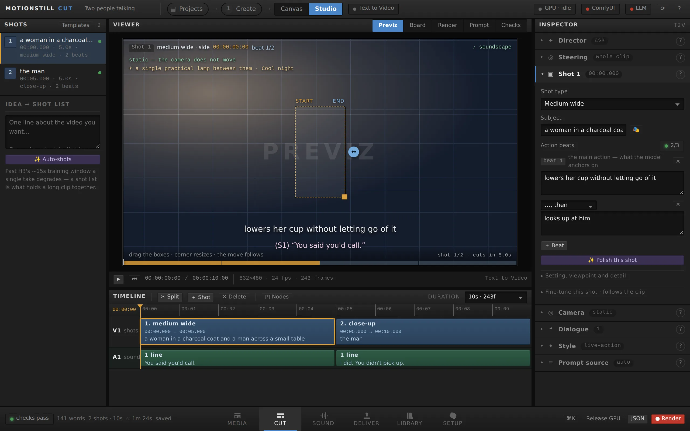
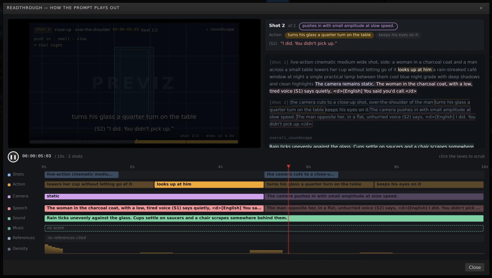

# Motionstill Cut

**A film editor for prompts.** Text, image and reference to video on **MiniMax
H3** and **LTX-2.5** — written in a DaVinci-Resolve-style NLE where a **local
LLM** and **your own ComfyUI** share the desk: one writes and critiques the prompt with you, the
other renders it, and they take turns on the same GPU. No cloud, no account,
no upload — the model that writes and the model that renders are both yours.

**Open the web app, or run it locally — same interface, every line of code
shared:**

```
Web    → https://motionstillcut.netlify.app · nothing to install · everything stays in your browser
Local  → git clone …/motionstillcut && node server/server.js   (Node 18+, zero deps)
```

**New here?** Press `F1` in the app — the guide has worked examples, recipes,
real screenshots and a searchable manual — or read [QUICKGUIDE.md](QUICKGUIDE.md).



---

## Two AIs, one desk

```
        you ──────────────┐
                          ▼
   ┌───────────────  Motionstill Cut  ───────────────┐
   │   shots · beats · camera pad · voices · previz  │
   └──────┬──────────────────────────────────┬───────┘
          │ writes, critiques,               │ renders, as a
          │ interviews, captions             │ stock-node graph
          ▼                                  ▼
   local LLM server                     your ComfyUI
   (LM Studio · Ollama ·                (MiniMax H3 ·
    llama.cpp — e.g. Gemma 3 12B)        LTX-2.5)
          ▲                                  ▲
          └────────── VRAM saver ────────────┘
             one engine on the GPU at a time
```

This pairing is the whole idea. The LLM is not a chatbox pasted onto an
editor — it **operates the app**:

- **The interview.** Paste a rough idea, drop your pictures, and Create
  interviews you — *reading the images* — then builds a working shot canvas.
  The clip settings use labeled dropdowns for scene, mood, image style, shot
  count, writing detail, model and length. Pick from 17 scene presets grouped
  into spaces, products and stories; **Rebuild shots** updates the chosen
  structure when you add reference pictures.
- **The director (⌘J).** "Bring her closer." "Why does it keep adding music?"
  It answers with a plan of concrete edits, each with its reason and a
  checkbox. Nothing lands until you press Apply; one ⌘Z takes it all back.
- **The second opinion.** Before you render, the model reads your compiled
  prompt the way a stranger would and tells you what it would actually make.
- **Captioning.** "Describe with the LLM" looks at a reference image and
  writes what it really shows — which is what makes an I2V opening match its
  first frame.
- **Your house rules.** Rate renders, tag failures, adopt the rule each tag
  implies — and every rewrite from then on carries what worked *on your box*.

And because H3's DiT (~20 GB) and a big text encoder do not co-fit on one
card, the **VRAM saver** makes them take turns: asking for a rewrite unloads
ComfyUI, queueing a render unloads the LLM — in whichever unload dialect your
LLM server speaks. A render in flight is never interrupted.

## What you can do with it

- **A two-person scene with voices that hold.** Speakers are people, not
  labels: describe a voice once and `(S1)` keeps it across every cut. Lines
  go in verbatim; "off screen" compiles H3's exact voiceover phrasing.
- **A product orbit from one photo.** Drop the photo (the mode flips to I2V
  by itself), describe the opening to match it, drag a small slow Orbit on
  the camera pad, render ×3 seeds, keep the best.
- **The same character next week.** Write `@anna` once and the same words
  describe her in shot 4 and next month — H3 has no memory, that text *is*
  the character. For a face lock, go Ref2V and pin her portrait
  `fully_preserved`.
- **Watch the prompt before you pay for it.** The readthrough (⇧Space) plays
  the instructions back in real time — every channel as a lane, the compiled
  text lighting up clause by clause. Previz shows the framing, the move at
  its real amplitude, even the lighting. A wrong prompt is minutes of GPU
  time; three ways to be wrong are free.

  
- **Controlled experiments.** Pin the seed, sweep one variable across N
  renders, diff two takes word by word in the Library, and turn the finding
  into a house rule.
- **Films longer than 15 seconds.** H3 renders 4–15 s per clip, so The Film
  cuts the writing into clips that each fit, chains them — each starting from
  the previous clip's final frame — and joins them with ffmpeg (local app).
  LTX-2.5 holds a real 30 s in one render; there, the Film can instead make
  **every hard cut its own clip** — a true cut between two files rather than
  one the model is asked to perform mid-clip.
- **Cuts as a control, not a hope.** Each shot after the first carries a
  cut — hard cut, dissolve, fade, or *no cut, same take* — on the timeline,
  the node canvas and the inspector, and each engine gets it in the words
  its own prompt guide uses.

What the encoder actually gets is a grammar, not prose — compiled from shots,
beats and the camera pad, checked against MiniMax's own prompt guides, and
frozen by golden tests:

```
integrated_multimodal_description: [Shot 1] A live-action cinematic medium
shot, front-facing: a woman in a charcoal coat. The setting is a rain-streaked
cafe window at night. Teal-and-orange grade with cool shadows and warm skin
tones. The camera remains static. Lowers her cup, then looks up. [Shot 2] At
00:04.500, the camera cuts to a close-up shot, front-facing of her hands. The
camera tilts down with small amplitude at slow speed. Twist the portafilter free.
```

You never type that by hand. You also never have to wonder what you are
sending.

## Pick a local LLM

Any OpenAI-compatible server works (LM Studio, Ollama, llama.cpp). The VRAM
saver means the LLM and the video model **take turns** — so size the model for
your card, not for co-fitting with a 20 GB DiT.

| Card | Model | Why |
|---|---|---|
| **12 GB+ — recommended** | **Gemma 3 12B** (instruct) | The sweet spot: strong prose, reliable JSON, and **vision** — one model covers the director, the rewriter *and* image captioning. ~8 GB at Q4/QAT. |
| ≤ 8 GB | Gemma 3 4B · Llama 3.1 8B | Rewrites and captions are fine; second opinions get shallower. |
| 24 GB+ | Gemma 3 27B · Qwen3 32B | The best director plans and critiques. Keep **Thinking Off** for Qwen3 — the app's default. |
| Vision on a budget | Qwen2.5-VL 7B as the separate *Vision model* | Pair it with any text model you like; Setup has both fields. |

Reasoning models deserve one sentence: **thinking does not need to be on for
this app — it is usually what breaks it.** A model that deliberates past its
token budget never reaches the answer; the app asks backends to skip thinking
in every dialect at once, strips any reasoning from replies, retries truncated
answers with a bigger budget, and — when something still fails — names the
setting to change instead of saying "try a larger model".

## The web app (client-only)

The hosted version is static files and nothing else — **no server-side saving
of any kind**. Settings live in localStorage; projects, library, house rules,
cast and media live in IndexedDB, in your browser. The page talks straight to
the two engines on your machine, which each need CORS switched on once:

- **ComfyUI** — start with `python main.py --enable-cors-header`
- **LM Studio** — Developer settings → enable CORS
- **Ollama** — run with `OLLAMA_ORIGINS=*`

The first visit opens a **setup conversation** — where your work lives, where
the engines are (with auto-detect), which model to feed the director. Re-run
it any time from ⌘K or Setup. And since the browser is the only place your
work exists, Setup carries one-click **Export / Restore backup**: everything,
media included, as one JSON file.

**Deploying your own:** the repo is Netlify-ready (`netlify.toml` publishes
`web/`, SPA fallback, no build step). Fork it, point a Netlify site at it,
done. Any static host works the same way.

## The local app (Node, optional server saving)

```
node server/server.js       # → http://127.0.0.1:3091
```

Node 18+ and nothing else — no `npm install`. The first run opens a one-page
wizard (`/setup`) with the one choice that matters:

1. **Local server saving — recommended.** Projects, library, rulebook, cast
   and settings as plain JSON under `data/` (readable, diffable, backed up
   with `cp`), both engines proxied so **no CORS flags anywhere**, and
   multi-clip films joined with ffmpeg.
2. **Browser only.** The hosted behaviour exactly, served from your machine:
   the Node process hosts the interface and persists nothing.

Env (all optional): `CUT_PORT` `CUT_HOST` `CUT_PW` `CUT_COMFY_URL`
`CUT_LLM_URL` `CUT_LLM_KEY` `CUT_VRAM_SAVER` `CUT_SAVING` `CUT_NO_OPEN`
`CUT_DATA` `CUT_FFMPEG`.

### Edit clips and DaVinci Resolve

**Edit clips** is in the top workflow bar, available from Create, Canvas and
Studio (shortcut **7**). Finished renders on Deliver offer **Add to edit** and
**Send to Resolve**. The Edit page sends the assembled timeline, including
source trims, clip names, muted clip audio and positioned audio tracks.

With local server saving enabled, set **Setup → DaVinci Resolve → MCP endpoint**
to `http://127.0.0.1:8765/mcp`, then **Test Resolve connection**. Start Resolve
and open the destination project. The MCP server must be on the same host as
Cut, with `resolve_status` and the checked `import_timeline` tool from the
local `~/ai/resolve-mcp` integration. The latter accepts `file_path`, `name`,
`expected_project`, `expected_clips` and `request_id`.

On this installation the MCP HTTP service starts at login:

```sh
systemctl --user status resolve-mcp.service
# Or run the server manually:
~/ai/resolve-mcp/.venv/bin/resolve-mcp --transport http --port 8765
```

Each send imports a new FCPXML timeline and saves the open Resolve project.
Existing timelines are preserved; repeated names receive a numeric suffix.
Media is prepared under `data/resolve/<transfer-id>/` (or `CUT_DATA/resolve`).
Keep that directory while Resolve references it. On Linux, the default media
preparation copies supported video streams into MOV with PCM audio, converts
other video codecs to ProRes, and prepares separate audio as WAV. Disable it
in Setup to use original media. ffmpeg is required for probing and preparation.

MCP sessions, streaming replies, tool errors and timeouts are handled by the
local Cut server. Transfer receipts and Resolve timeline markers guard against
duplicate sends. Resolve must still have the same destination project open
when the import begins. The hosted browser-only version explains how to use
the local app instead. Optional environment overrides: `CUT_RESOLVE_URL` and
`CUT_RESOLVE_KEY`; access tokens stay on the Cut server.

## What it needs to render

MiniMax H3 (Hailuo 3.0, open weights) — an omni-modal DiT that generates
video with native 32 kHz audio in one pass — on **your own ComfyUI**, stock
nodes only: every node this editor emits ships with ComfyUI, which is what
makes the downloaded workflow run on anyone's install. The Setup page checks
the node catalog by name, lists the model files (the Comfy-Org repack plus the
Turbo distills) and hands over exact download commands.

### The second engine: LTX-2.5

**Lightricks' LTX-2.5** renders the same timeline (T2V/I2V; still marked
*experimental* in the UI while it settles). It is not the H3 prompt pushed
through another model — the compiler speaks each model's own dialect:

- **Its own prompt grammar.** Where H3 gets `[Shot N]` markers and timestamps,
  LTX gets what its prompting guide asks for: one chronological paragraph, no
  timestamps or shot numbers, every cut named in prose (`A hard cut
  transitions to a close-up shot …`), the new shot re-established in full, the
  audio continuity stated at each cut, dialogue as quoted lines with the voice
  named, and the ambient sound described at the end. Lightricks' prompt
  enhancer stays **off** — it helps a thin prompt and dilutes a compiled one.
- **Its own pipeline.** Stock ComfyUI LTX-2 AV nodes, Two-stage (8+3) or
  Single-stage 8-step distilled builds, cfg 1, frame counts on LTX's 8k+1 grid,
  clips to a real **30 s**. Five model files (~40 GB, listed under Setup ▸
  Models); a ComfyUI without the LTX nodes still renders MiniMax.
- **Pins on the timeline → `LTXVAddGuide`.** Attach an image to a shot and
  the graph anchors it at that shot's cut time, strength per pin. The app
  tells you what the node won't: guides land on an **8-frame grid**, so the
  pin row prints the frame it really hits (`→ f104 · 00:04.333`) instead of
  letting it look like drift; and the **same image pinned at two or more
  cuts at strength ≥ 0.7 freezes the character** — the checker warns.
- **Cuts that actually render.** Measured on the model, not read from the
  guide, 21 renders scored per frame and then read frame by frame: LTX-2.5
  places a seam at nearly every cut you write, and what the prompt decides
  is whether the seam lands as a hard cut or a dissolve. A spoken line in
  every shot, a cutaway to a different subject, and a different angle and
  camera move per shot with the new shot re-established make seams land as
  cuts; one silent subject travelling through connected spaces dissolves
  through them. The Two-stage 8+3 build hardens seams the prompt has placed
  (four dissolves became three hard cuts on the same seed). Create's
  generator is steered by this — angle and move varied per shot, dialogue
  dealt across shots, shots held to 3 s or more — and the checker flags the
  "silent cuts", "only shot 1 speaks" and "single-stage with cuts" cases. Or take the sure route: **one render
  per hard cut**, joined afterwards.
- **The Engine sweep.** Same timeline, same references, seed pinned, both
  engines — the closest thing to a controlled comparison of what H3's grammar
  is worth on a model that wasn't trained on it.

No GPU at all? The app is still a full prompt editor: everything compiles,
previews and lints, and the workflow downloads as JSON.

## The loop

Prompt engineering is not writing a prompt. It is **idea → prompt → result →
learn → better prompt**, and a tool that stops at "prompt" makes you re-learn
the same lesson every session:

| | |
|---|---|
| **Compose** | The node canvas, the guided Create flow, or the studio pages — the prompt is a grammar with controls, and the LLM edits it *with* you. |
| **Preview** | The readthrough, the lit previz, the checker, the second opinion. Three ways to be wrong for free. |
| **Render** | Stock-node ComfyUI graph, downloaded or queued, one engine on the GPU at a time. |
| **Judge** | Every render lands in the Library with the exact text that made it. Rate it; name what went wrong. |
| **Learn** | Word-level diffs, seed-pinned sweeps, and house rules that ride along with every rewrite. |

## Architecture, briefly

One front end (`web/`), two interchangeable backends behind the old Cut
server's API contract — no page module knows which one answered:

- `web/js/backend/` — the **client backend**: every route answered inside the
  tab (localStorage + IndexedDB + direct engine fetches; the film's
  last-frame job done by the browser's own decoder).
- `server/` — the **local app**: the original zero-dependency Node server
  plus the first-use wizard; one injected line in index.html tells the page
  which backend is live, and every persistence route answers 403 when saving
  is off.

## Tests

```
npm test
```

150 tests, Node's own runner, no dependencies: the compiler against golden
files, the film planner, the linter run over MiniMax's canonical examples,
cast handling, the fresh-start templates.

## License

[MIT](LICENSE)
